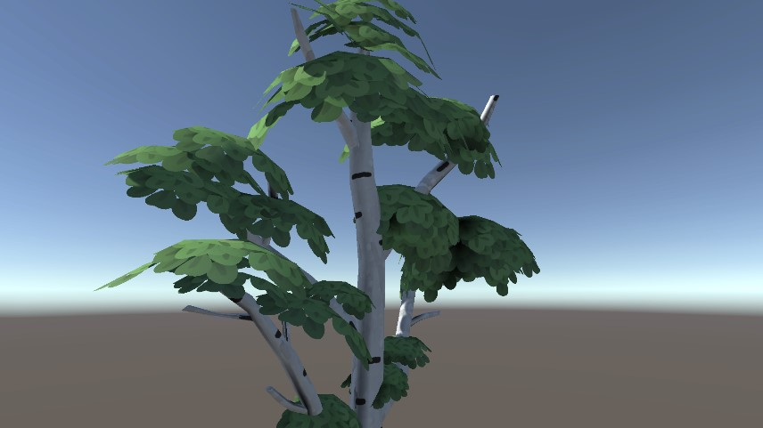
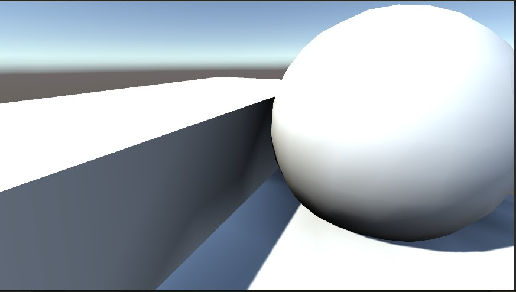

# Vertex AO

A proof of concept for a simple per-vertex ambient occlusion baking system.

> Developed and with Unity 2020.3.16f1 LTS

## Components

The mesh processing pipeline consists of the following stages:

- **Tesselation** - subdivides original geometry to improve the level of detail of per-vertex AO.
- **Vertex AO** - computes per-vertex ambient occlusion and writes it to vertex colors.
  - AO is visualized via a custom Shader Graph (Universal Render Pipeline is used).
- **Simplify Mesh** - applies adaptive mesh simplification. Depending on the parameters (weights), can lead to significantly fewer triangles in uniform areas and almost no change in detailed areas.

## More examples

| No AO                                       | AO                                        |
|---------------------------------------------|-------------------------------------------|
|    |  |
|  |  |
|      |  |
|  |  |

## Performance

The Sponza scene (shown in .gif in the [main section](#vertex-ao)) takes **3.43 seconds** to bake on a laptop with AMD Ryzen R7 4800H and Nvidia GTX 1660 Ti.

The scene consists of around **800k triangles**.

Most of the steps rely on **Compute Shaders** and **Unity Job System** for optimization.

## Known limitations

- Works only for models with 1 submesh.
- Topology after mesh simplification is far from ideal.
- Algorithms are mostly naive and not optimized.

## Used Assets

Models downloaded from Morgan McGuire's [Computer Graphics Archive](https://casual-effects.com/data):

- Serapis Bust
- Crytek Sponza

Models by [Quaternius](https://quaternius.com/index.html):

- [Textured Stylized Trees](https://quaternius.com/packs/stylizedtree.html)